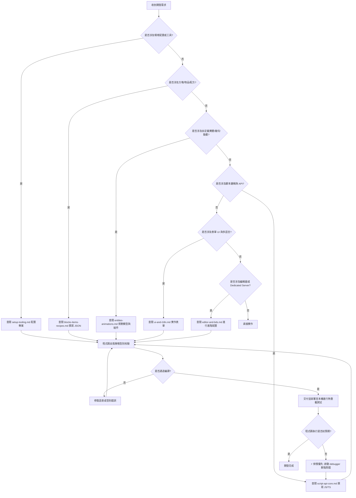

# 麥塊基岩版官方 Creator 開發規範與 Script API 指南

本技能包為 Minecraft 基岩版（Bedrock Edition）Add-on 開發與 Script API 編寫的官方正規指南，用以引導 AI 助手在生成與修改代碼時，遵循最嚴緊、防禦性最強的核心架構與除錯規範。

---

## 1. 開發思考模型決策樹

當收到開發或修改 Minecraft Bedrock Add-on 的請求時，AI 必須遵循以下決策樹進行規劃與實作：

---

## 2. ⚡️ 核心開發與除錯守則

AI 在為人類編寫程式時，必須嚴格遵守以下三條防禦性核心守則：

### 🛑 守則一：除錯優先 (Debugger-First Logic)
當程式碼執行不如預期、拋出異常或邏輯卡死時，**絕對禁止盲目猜測並無意義地頻繁修改程式碼**。
AI 必須優先指引人類配置並啟動 **`mojang/minecraft-debugger`** VS Code 插件，進行真實的斷點檢查與單步執行（Step-through），找出精確出錯的變數或事件上下文，然後實施精確修復。

### 🛑 守則二：唯讀事件保護鎖與延遲調度
在 `@minecraft/server` 的 `beforeEvents`（如 `playerBreakBlock`、`chatSend`）事件監聽器中，遊戲引擎會將世界狀態鎖定為唯讀。在此監聽器內直接調用任何會改變世界狀態的 API（例如 `entity.teleport`、`world.sendMessage`、spawnEntity 等）會引發嚴重的執行期崩潰。
* **解決方案**：AI 必須將所有寫入操作包裹在 `system.run(() => { ... })` 中，將其延遲到下一個 Tick（微秒級延遲）執行，從而繞過唯讀保護鎖，杜絕崩潰。

### 🛑 守則三：自動靜態型別校驗 (Static Compilation Guard)
在生成、重構或修改 any JavaScript/TypeScript 腳本代碼後，AI 在交付成果前，若專案中配有 TypeScript 環境（如 `tsconfig.json`），**必須自動執行 `npx tsc --noEmit` 或 `npm run build` 進行靜態型別編譯檢驗**。確保 100% 沒有語意、語法與型別錯誤後，才可交付予人類開發者。

---

## 3. 本地知識分類索引 (References)

詳細的官方 API 規範、Schema 設定與專案實作指南，已依據微軟 Creator 官網架構分類存於以下本地參考文件中。AI 應視需求使用相對路徑調閱：

* **[開發環境與工具鏈指南](references/setup-tooling.md)**：包含本機開發路徑、`manifest.json` UUID 與 dependencies 設定，以及 **`@minecraft/bedrock-schemas` 的 VS Code 整合配置**。
* **[自定義實體與幾何動畫規範](references/entities-animations.md)**：自定義實體的 Behavior JSON 元件、Blockbench 幾何結構與動畫控制器狀態機。
* **[自定義方塊、物品與配方規範](references/blocks-items-recipes.md)**：方塊屬性、Permutations、自定義物品組件、合成配方與戰利品表宣告。
* **[Script API 腳本核心開發規範](references/script-api-core.md)**：包含 `@minecraft/server` API 開發、**Beta 與 Stable 版本的硬性劃分邊界**、監聽訂閱（`subscribe`/`unsubscribe`）的資源清理指引。
* **[表單 UI 與 i18n 本地化規範](references/ui-and-i18n.md)**：`@minecraft/server-ui` 三大表單模版與 RawMessage 多語言防崩潰地雷指南。
* **[編輯器與 BDS 伺服器配置](references/editor-and-bds.md)**：`@minecraft/server-editor` 可視化編輯器擴充開發與專用伺服器設定。
