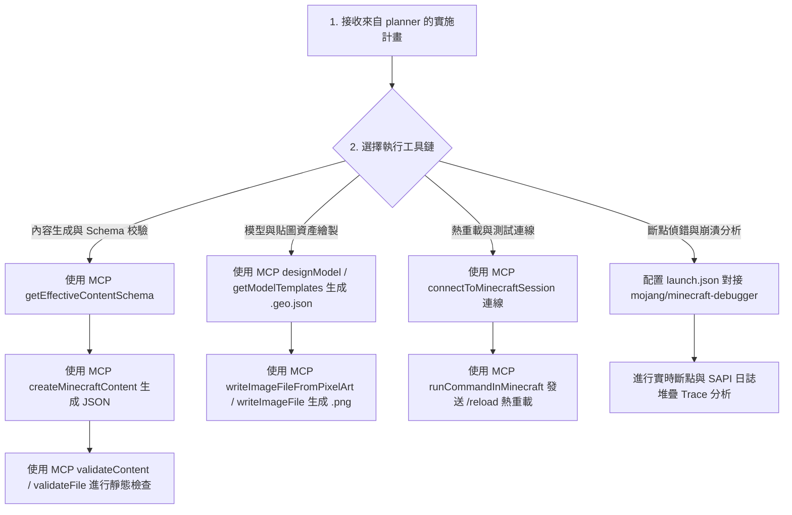

# ⚡️ 麥塊基岩版：操作與執行工具技能包 (Minecraft Bedrock Executor)

本技能包專注於計畫確定後的 **「工具調用、內容生成、資產繪製、靜態校驗、熱重載測試與 Debugger 斷點操作」**。

---

## 🛠️ 操作與執行流程樹 (Execution Flowchart)

---

## ⚡️ 核心工具操作指南

### 1. MCP 內容與 Schema 驗證工具鏈 (`minecraft-creator-tools`)
* **Schema 檢索**：調用 `getEffectiveContentSchema` 取得官方最新欄位規範。
* **標準檔生成**：調用 `createMinecraftContent` / `addItem` 自動產生符合規範的 Add-on 檔案。
* **靜態校驗**：在寫入任何檔案後，調用 `validateContent` 或 `validateFile` 進行語意檢查，防止語法錯誤。

### 2. Blockbench 幾何模型與貼圖工具鏈
* **3D 模型生成**：調用 `designModel` 與 `getModelTemplates` 自動生成 Blockbench 相容的 `.geo.json` 模型。
* **像素貼圖繪製**：調用 `writeImageFileFromPixelArt` / `writeImageFile` 生成資源包對應 `.png` 貼圖。

### 3. 熱重載與連線測試工具鏈
* **會話連線**：調用 `connectToMinecraftSession` / `listMinecraftSessions` 連線至遊戲或 BDS。
* **熱重載**：腳本變更後，調用 `runCommandInMinecraft` 發送 `/reload` 命令實施熱重載，避免重啟伺服器。

### 4. 斷點與崩潰偵錯工具鏈 (Debugger-First)
* **對接偵錯**：透過 `.vscode/launch.json` 對接 `mojang/minecraft-debugger` 插件進行斷點單步執行 (Step-through)。
* **崩潰 Trace 分析**：捕獲 BDS 的 SAPI 崩潰 Stack Trace，定位變數並精確修復。
