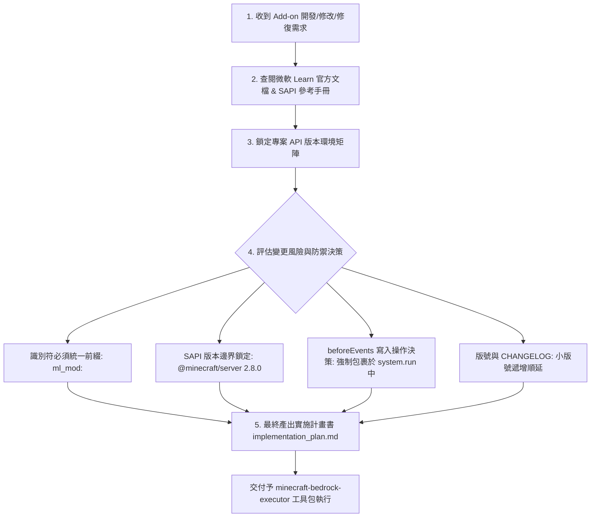

# 🧠 麥塊基岩版：計畫與決策技能包 (Minecraft Bedrock Planner)

> **🎯 本技能的最終唯一目的**：**查閱微軟 Learn 官方文檔並鎖定專案環境，最終寫出一份防禦性強、結構清晰的『開發與修復實施計畫書 (`implementation_plan.md`)』。**

---

## 🌴 官方文檔查閱與計畫產出決策樹 (Planning Decision Tree)

當收到任何 Add-on 開發、修改或修復需求時，AI **必須嚴格遵循以下決策樹進行文檔查閱並寫出計畫書**：

---

## 📋 實施計畫書 (`implementation_plan.md`) 強制規範

本技能產出的計畫書必須包含以下 **四大核心章節**：

### 章節一：專案 API 版本與環境邊界矩陣
明確鎖定執行層不可跨越的版本邊界：
* **SAPI 模組版本**：`@minecraft/server: 2.8.0` / `@minecraft/server-ui: 1.2.0`
* **最低引擎相容版本**：`min_engine_version: [1, 20, 0]`
* **腳本進入點與語言**：JavaScript / `scripts/main.js`
* **識別符命名空間**：`ml_mod:`

### 章節二：微軟 Learn 官方文檔與 Schema 鏈接引導
提供權威參考來源，避免執行層憑空猜測：
* **SAPI API 官方文件**：引用 [Microsoft Learn SAPI Reference](https://learn.microsoft.com/en-us/minecraft/creator/scriptapi/)。
* **JSON Component Schema**：引導執行層調用 MCP `getEffectiveContentSchema` 取得微軟官方 `minecraft-json-schemas` 的最新定義。

### 章節三：變更模組與防護架構決策 (ReadOnly Guard Policy)
在 `@minecraft/server` 的 `beforeEvents`（如 `playerBreakBlock`、`chatSend`）中，世界狀態為唯讀。凡涉及改變世界狀態的操作，**計畫書中必須明確記錄強制包裹於 `system.run(() => { ... })` 中**，杜絕 BDS 崩潰。

### 章節四：執行層 (Executor) 工具調用指引
指示 `minecraft-bedrock-executor` 後續應調用的工具（如 MCP `createMinecraftContent` 建立檔、MCP `validateContent` 靜態校驗、MCP `runCommandInMinecraft` 發送 `/reload` 熱重載、`mojang/minecraft-debugger` 對接斷點）。
