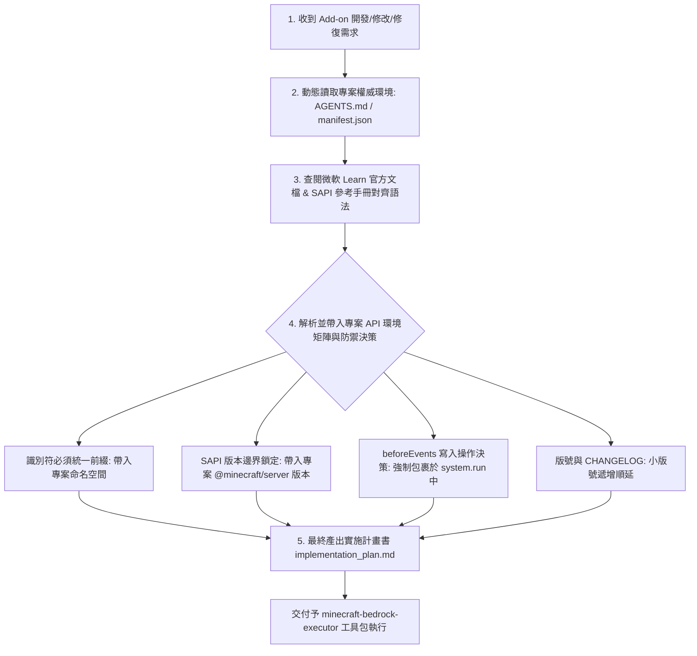

# 🧠 麥塊基岩版：計畫與決策技能包 (Minecraft Bedrock Planner)

> **🎯 本技能的最終唯一目的**：**動態讀取專案權威環境定義，對照微軟 Learn 官方文檔，最終產出一份防禦性強、結構清晰的『開發與修復實施計畫書 (`implementation_plan.md`)』。**

---

## 🌴 官方文檔查閱與計畫產出決策樹 (Planning Decision Tree)

當收到任何 Add-on 開發、修改或修復需求時，AI **必須嚴格遵循以下決策樹動態解析環境並寫出計畫書**：

---

## 📋 實施計畫書 (`implementation_plan.md`) 強制規範

本技能產出的計畫書必須包含以下 **四大動態引導章節**：

### 章節一：動態專案 API 版本與環境邊界矩陣
計畫書必須開宗明義動態解析並載入專案權威檔案 [`.agents/AGENTS.md`](file:///.agents/AGENTS.md) 或 `manifest.json` 所定義的環境：
* **SAPI 模組版本**：解析自專案 `dependencies` 的 `@minecraft/server` 與 `@minecraft/server-ui` 版本
* **最低引擎相容版本**：解析自 `min_engine_version`
* **腳本進入點與語言**：解析自 `entry`
* **識別符命名空間**：解析自專案權威命名空間
* **防崩潰保護策略**：`beforeEvents` 寫入操作強制包裹於 `system.run()`

### 章節二：微軟 Learn 官方文檔與 Schema 引導 (優先本地文檔庫)
提供權威參考來源，確保計畫與執行層對齊官方標準：
* **本地官方 Learn 文檔庫 (首選)**：優先引導查閱專案本地的微軟官方文檔庫 [`scratch/minecraft-creator/`](file:///c:/Users/a0900/.gemini/antigravity-ide/scratch/my_minecraft_addon/scratch/minecraft-creator/) 以及 Mojang 官方代碼範本庫 [`scratch/bedrock-samples/`](file:///c:/Users/a0900/.gemini/antigravity-ide/scratch/my_minecraft_addon/scratch/bedrock-samples/)。
* **線上官方檔與 Schema 輔助**：必要時可導向 [Microsoft Learn SAPI Reference](https://learn.microsoft.com/en-us/minecraft/creator/scriptapi/) 或指示執行層調用 MCP `getEffectiveContentSchema` 取得最新 Component 定義。

### 章節三：變更模組與防護架構決策 (ReadOnly Guard Policy)
在 `@minecraft/server` 的 `beforeEvents`（如 `playerBreakBlock`、`chatSend`）中，世界狀態為唯讀。凡涉及改變世界狀態的操作，**計畫書中必須明確記錄強制包裹於 `system.run(() => { ... })` 中**，杜絕 BDS 崩潰。

### 章節四：執行層 (Executor) 工具調用指引
指示 `minecraft-bedrock-executor` 後續應調用的工具（如 MCP `createMinecraftContent` 建立檔、MCP `validateContent` 靜態校驗、MCP `runCommandInMinecraft` 發送 `/reload` 熱重載、`mojang/minecraft-debugger` 對接斷點）。
