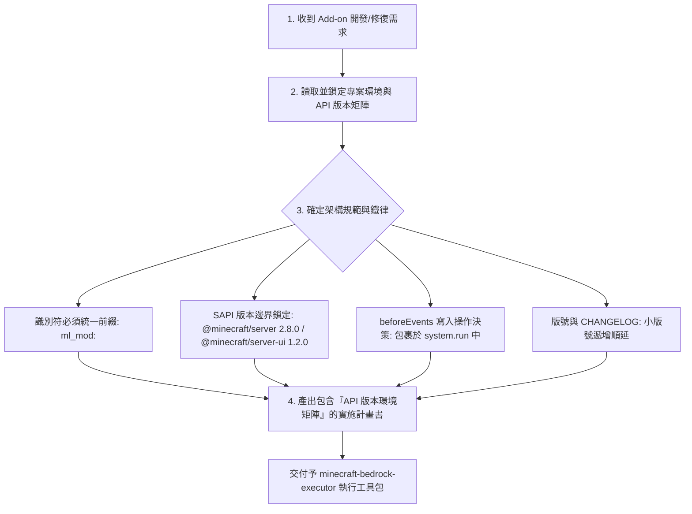

# 🧠 麥塊基岩版：計畫與決策技能包 (Minecraft Bedrock Planner)

本技能包專注於開發前期的 **「需求分析、環境與 API 版本鎖定、防禦性架構規劃與計畫擬定」**，確保在調用任何執行工具前，計畫書已 100% 鎖定專案環境與鐵律。

---

## 🎯 決策與計畫流程樹 (Planning Flowchart)

---

## 📋 核心決策與計畫書強制規範

### 1. 計劃書必須顯性聲明「API 版本與環境邊界矩陣」
計畫階段產出的任何實施計畫，**必須首要明確條列當前專案的 API 版本環境**，確保執行層不會跨越版本邊界：

* **SAPI 模組版本**：`@minecraft/server: 2.8.0` / `@minecraft/server-ui: 1.2.0`
* **最低引擎相容版本**：`min_engine_version: [1, 20, 0]`
* **腳本語言與進入點**：JavaScript / `scripts/main.js`
* **命名空間與識別符**：`ml_mod:`
* **防崩潰環境保護**：`beforeEvents` 寫入操作強制決策使用 `system.run()`

### 2. 唯讀事件保護鎖決策 (ReadOnly Guard Policy)
在 `@minecraft/server` 的 `beforeEvents`（如 `playerBreakBlock`、`chatSend`）事件中，世界狀態為唯讀。凡涉及改變世界狀態的 API 操作，**計畫階段必須強制決定包裹在 `system.run(() => { ... })` 中**，延遲至下一 Tick 執行，杜絕 BDS 崩潰。

### 3. 專案鐵律決策
* **命名空間**：所有識別符（方塊、物品、實體、粒子、維度）強制使用 `ml_mod:` 前綴。
* **熱重載 Policy**：修改 `.js` 腳本時計劃進行 `/reload` 熱重載，禁止無故重啟 BDS。

### 4. 官方文檔與 Schema 鏈接引導 (Official Docs & Schema Linking)
當計畫書涉及複雜 Component、自訂實體組件或 SAPI API 時，**必須在計畫書中包含微軟 Learn 官方參考連結或 MCP 語意校驗依據**：
* **SAPI 官方文件引導**：引用 [Microsoft Learn SAPI Reference](https://learn.microsoft.com/en-us/minecraft/creator/scriptapi/)。
* **JSON Component Schema 引導**：引導執行層調用 MCP `getEffectiveContentSchema` 取得微軟官方 `minecraft-json-schemas` 的最新欄位定義。

