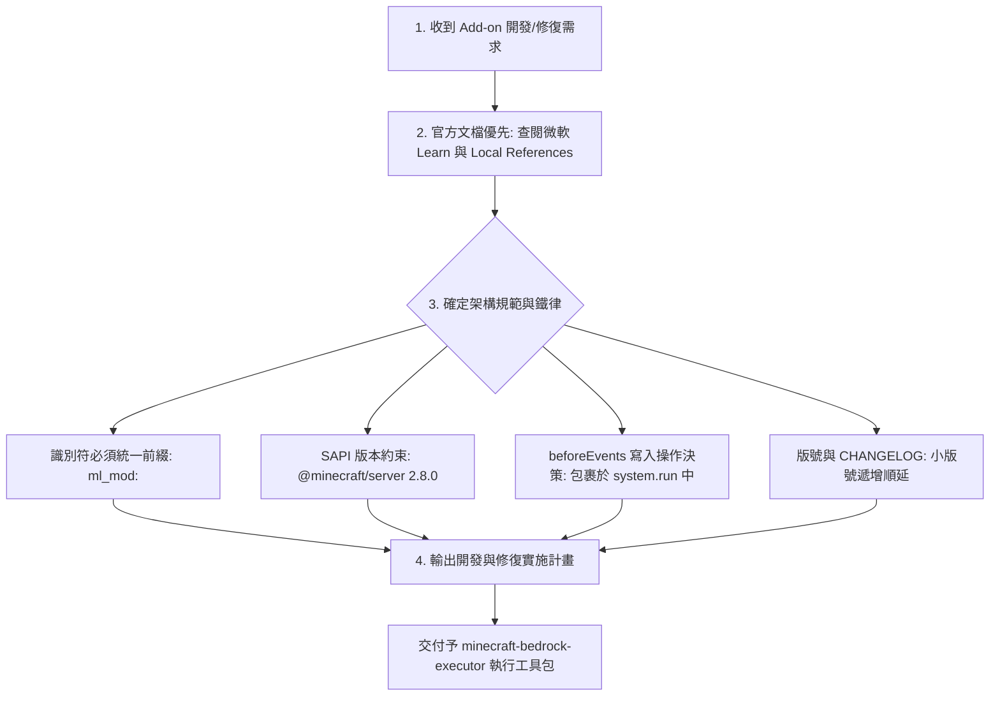

# 🧠 麥塊基岩版：計畫與決策技能包 (Minecraft Bedrock Planner)

本技能包專注於開發前期的 **「需求分析、官方文檔對齊、防禦性架構規劃與計畫擬定」**，確保在調用任何執行工具前，方案已 100% 符合微軟官方 Learn 規範與專案鐵律。

---

## 🎯 決策與計畫流程樹 (Planning Flowchart)

---

## 📋 核心決策與防禦性守則

### 1. 官方文檔優先 (Official Docs First)
在擬定方案前，**必須先查閱微軟 Learn 官方文件或本地 `references/` 規範**，確定該版本的組件語法 (Component Schema) 與 API 方法簽名，禁止憑空猜測欄位名稱。

### 2. 唯讀事件保護鎖決策 (ReadOnly Guard Policy)
在 `@minecraft/server` 的 `beforeEvents`（如 `playerBreakBlock`、`chatSend`）事件中，世界狀態為唯讀。凡涉及改變世界狀態的 API 操作，**計畫階段必須強制決定包裹在 `system.run(() => { ... })` 中**，延遲至下一 Tick 執行，杜絕 BDS 崩潰。

### 3. 專案鐵律決策
* **命名空間**：所有識別符（方塊、物品、實體、粒子、維度）強制使用 `ml_mod:` 前綴。
* **熱重載 Policy**：修改 `.js` 腳本時計畫進行 `/reload` 熱重載，禁止無故重啟 BDS。

---

## 📚 本地官方知識分類索引 (References)

* **[開發環境與工具鏈指南](references/setup-tooling.md)**：包含 `manifest.json` UUID 與 dependencies 規範。
* **[自定義實體與幾何動畫規範](references/entities-animations.md)**：自定義實體 Behavior JSON 與幾何結構規範。
* **[自定義方塊、物品與配方規範](references/blocks-items-recipes.md)**：方塊屬性、Permutations 與戰利品表宣告。
* **[Script API 腳本核心開發規範](references/script-api-core.md)**：`@minecraft/server` API 規範與資源清理。
* **[表單 UI 與 i18n 本地化規範](references/ui-and-i18n.md)**：`@minecraft/server-ui` 三大表單與多語言規範。
* **[編輯器與 BDS 伺服器配置](references/editor-and-bds.md)**：BDS 伺服器配置與偵錯對接說明。
