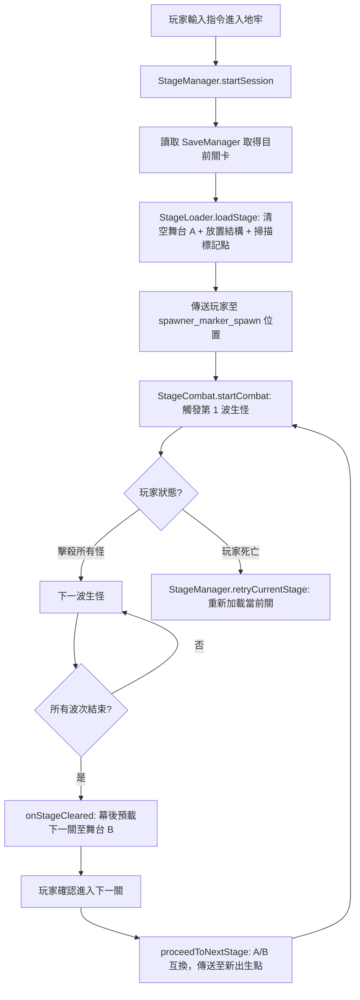

# 🏰 ml_dungeon 地牢系統開發定義書 (Design Specification)

> **版本**：v1.0.0｜**最後更新**：2026-07-21｜**適用模組**：`addons/ml_dungeon_BP`

---

## 一、系統總覽 (System Overview)

ml_dungeon 是一套以 **Minecraft Bedrock Script API** 驅動的地牢副本戰鬥系統。  
其核心設計目標為：

1. **零停頓**的多關卡副本輪轉（採用雙舞台 Ping-Pong 幕後預載機制）。  
2. **資料驅動**的關卡設計（只需編輯 `stages_config.js` 即可新增關卡，無需改動核心邏輯）。  
3. **精確波次控制**（透過場景中擺放的不可見標記方塊，精確定義生怪位置）。

---

## 二、命名空間規範 (Namespace Rules)

| 項目 | 規範值 |
| :--- | :--- |
| **統一命名空間** | `ml_mod:` |
| **自訂維度 ID** | `ml_mod:dungeon_dim` |
| **結構讀取路徑** | `ml_mod:{structureName}` (例：`ml_mod:test1`) |
| **標記方塊 ID** | `ml_mod:spawner_marker_{1~9}` 與 `ml_mod:spawner_marker_spawn` |

> [!IMPORTANT]
> 所有新增的方塊、物品、粒子、腳本識別符必須以 `ml_mod:` 開頭，禁止使用其他命名空間。

---

## 三、雙舞台座標 (Dual Stage Locations)

| 舞台 | 起點座標 | 掃描範圍 | 說明 |
| :--- | :--- | :--- | :--- |
| **舞台 A** | `(0, 64, 0)` | `64 x 64 x 64` 格 (索引 0~63) | 第一個啟動的活躍關卡舞台 |
| **舞台 B** | `(200, 64, 0)` | `64 x 64 x 64` 格 (索引 0~63) | 幕後預載下一關時使用 |

**雙舞台 Ping-Pong 流程：**

```mermaid
sequenceDiagram
    participant 玩家
    participant 舞台A (0,64,0)
    participant 舞台B (200,64,0)

    玩家->>舞台A: 進入第1關，載入結構 + 傳送至 spawn
    Note over 舞台A: 戰鬥進行中...
    玩家->>舞台A: 第1關通關
    舞台A-->>舞台B: 幕後同步預載第2關結構
    玩家->>舞台B: 確認進入，傳送至新 spawn
    Note over 舞台B: 第2關戰鬥進行中...
    舞台B-->>舞台A: 幕後同步預載第3關結構
```

---

## 四、標記方塊系統 (Marker Block System)

地牢關卡設計者在 `.mcstructure` 結構中**擺放標記方塊**，系統啟動後自動掃描並讀取位置。

### 標記方塊一覽

| 方塊 ID | 外觀 | 用途 |
| :--- | :--- | :--- |
| `ml_mod:spawner_marker_spawn` | 完全透明 | **玩家出生點**：加載完成後傳送玩家至此 |
| `ml_mod:spawner_marker_1` | 完全透明 | **位置標記 1**：關卡設計師自由指定使用 |
| `ml_mod:spawner_marker_2` | 完全透明 | **位置標記 2**：關卡設計師自由指定使用 |
| `ml_mod:spawner_marker_3` ~ `9` | 完全透明 | **位置標記 3~9**：關卡設計師自由指定使用 |

### 物理特性

- `minecraft:collision_box: false`（零碰撞，玩家可穿越）
- `minecraft:light_dampening: 0`（零遮光）
- **永久保留，不被系統清除**（設計者定義的位置即為正式生效位置）

### 手持顯現粒子

- 玩家手持任意標記方塊時，系統 (`MarkerVisibilityManager.js`) 會以 **16 格半徑**掃描所有標記方塊並發射 2D Billboard 相機轉向數字粒子加以顯示。

---

## 五、關卡設定檔 (Stage Configuration)

**檔案路徑**：[`addons/ml_dungeon_BP/scripts/dungeon/stages_config.js`](file:///c:/Users/a0900/.gemini/antigravity-ide/scratch/my_minecraft_addon/addons/ml_dungeon_BP/scripts/dungeon/stages_config.js)

### 資料結構定義

```js
STAGE_CONFIGS = {
    [stageNumber]: {
        name: String,               // 顯示給玩家的關卡名稱 (繁體中文)
        structureName: String,       // .mcstructure 檔名 (不含 namespace, 不含副檔名)
        spawnLocationOffset: { x, y, z }, // 若結構中缺少 spawn 標記時的退而求其次位置
        waves: [
            {
                wave: Number,        // 波次序號 (1 開始)
                markerId: String,    // 對應的標記方塊號碼 (如 "1", "9")
                mobType: String,     // 怪物 ID (如 "minecraft:zombie")
                count: Number,       // 生怪數量
                nameTag: String,     // 怪物名稱顯示 Tag (支援樣式代碼 §c 等)
                isBoss: Boolean      // 是否為 BOSS 標記
            }
        ]
    }
}
```

### 新增關卡流程

1. 在 `stages_config.js` 中新增一個新的 `[stageNumber]` 物件。
2. 製作或匯入對應的 `.mcstructure` 檔案至 `structures/ml_mod/` 目錄下。
3. 在結構中擺放 `spawner_marker_spawn`（出生點，必要）以及各波生怪點 `spawner_marker_1~9`。
4. 完成，無需修改核心系統程式碼！

---

## 六、核心腳本模組 (Core Script Modules)

| 檔案 | 職責 |
| :--- | :--- |
| [`StageManager.js`](file:///c:/Users/a0900/.gemini/antigravity-ide/scratch/my_minecraft_addon/addons/ml_dungeon_BP/scripts/dungeon/StageManager.js) | 地牢副本主控制器，統籌進入/通關/重試/傳送/預載 |
| [`StageLoader.js`](file:///c:/Users/a0900/.gemini/antigravity-ide/scratch/my_minecraft_addon/addons/ml_dungeon_BP/scripts/dungeon/StageLoader.js) | 結構放置、區域清空、標記方塊掃描 |
| [`StageCombat.js`](file:///c:/Users/a0900/.gemini/antigravity-ide/scratch/my_minecraft_addon/addons/ml_dungeon_BP/scripts/dungeon/StageCombat.js) | 波次驅動器：生怪、計數、擊殺監聽、通關觸發 |
| [`SaveManager.js`](file:///c:/Users/a0900/.gemini/antigravity-ide/scratch/my_minecraft_addon/addons/ml_dungeon_BP/scripts/dungeon/SaveManager.js) | 玩家進度存檔讀取 (World Dynamic Properties) |
| [`MarkerVisibilityManager.js`](file:///c:/Users/a0900/.gemini/antigravity-ide/scratch/my_minecraft_addon/addons/ml_dungeon_BP/scripts/dungeon/MarkerVisibilityManager.js) | 手持標記方塊時觸發粒子可視化顯示（R=16 格） |
| [`stages_config.js`](file:///c:/Users/a0900/.gemini/antigravity-ide/scratch/my_minecraft_addon/addons/ml_dungeon_BP/scripts/dungeon/stages_config.js) | 【資料層】純資料設定檔，定義所有關卡與波次資料 |

---

## 七、玩家生命周期流程 (Player Lifecycle)



---

## 八、死亡與重試機制 (Death & Retry)

- 玩家在地牢維度死亡時，系統監聽 `entityDie` 事件。
- 死亡後 **60 ticks (3 秒)** 自動觸發 `retryCurrentStage`。
- 重試時：**重新清空舞台 → 重新放置結構 → 重新掃描標記點 → 重新傳送至 spawn → 重新從第 1 波開始**。
- **不扣除玩家進度**（只有通關才寫入 SaveManager）。

---

## 九、結構檔規範 (.mcstructure Convention)

| 規則 | 說明 |
| :--- | :--- |
| **存放路徑** | `addons/ml_dungeon_BP/structures/ml_mod/{name}.mcstructure` |
| **最大尺寸上限** | **64 x 64 x 64 格（索引 0 ~ 63）**，超過此範圍的方塊不會被清空與掃描 |
| **放置原點** | 結構左下角應對齊舞台原點 `(0,0,0)`，系統會動態加上舞台偏移 |
| **出生點標記** | 必須擺放 **1 個且只有 1 個** `spawner_marker_spawn` 標記方塊 |
| **生怪點標記** | 擺放 `spawner_marker_1` ~ `9`，可以在同一號碼擺放多個（系統會輪詢）|
| **清空結構** | `dungeon_clear.mcstructure` = 64x64x64 純空氣結構，存於 `structures/ml_mod/dungeon_clear.mcstructure` |

---

## 十、待定義與待實作項目 (Open Items)

> [!NOTE]
> 以下功能已在規劃中，尚未實作，歡迎與 AI 協作討論細節。

- [ ] **進入地牢的玩家介面 (Form UI)**：使用 `@minecraft/server-ui` 的 ActionFormData 選單讓玩家選擇要挑戰的關卡。
- [ ] **多玩家副本隔離**：目前系統設計為單一 `StageManager` 全域單例，未來需擴充為每位玩家獨立副本實例。
- [ ] **通關獎勵系統**：通關後給予玩家物品/金幣/積分獎勵（可整合 `SaveManager` 的動態屬性擴充）。
- [ ] **副本時限 (Timer)**：加入倒數計時機制，時間到自動視為挑戰失敗。
- [ ] **怪物進階 AI 組態**：目前怪物使用原版 AI，未來可掛載自訂 Behavior Pack 組件以強化怪物行為。
- [ ] **關卡地圖設計**：目前僅有 `test1.mcstructure` 測試地圖，需設計與製作正式關卡地圖。

---

## 十一、解耦與觸發層設計原則 (Trigger Decoupling Principles)

> [!IMPORTANT]
> **開發期驗證工具 (Dev Test Harness)**：
> 目前的 `openDungeonTestDDUI` 測試控制台面板僅作為開發階段驗證傳送、結構加載與波次戰鬥的測試介面。

### 核心模組 100% 解耦設計
核心邏輯 (`StageManager` / `StageLoader` / `StageCombat` / `SaveManager`) 採用獨立 API 架構，**不與任何特定 UI 介面強綁定**。未來可以無縫切換為多種正式遊戲觸發途徑：

1. **NPC 對話互動**：右鍵點擊副本對話 NPC 觸發 `stageManager.startSession(player)`。
2. **門戶方塊/區域踩踏**：玩家踏入特定副本傳送門框時觸發。
3. **地牢鑰匙/道具使用**：玩家在背包中使用「古老鑰匙」時消耗道具並傳送。
4. **任務與成就結算**：完成特定世界任務後自動啟動地牢挑戰。

