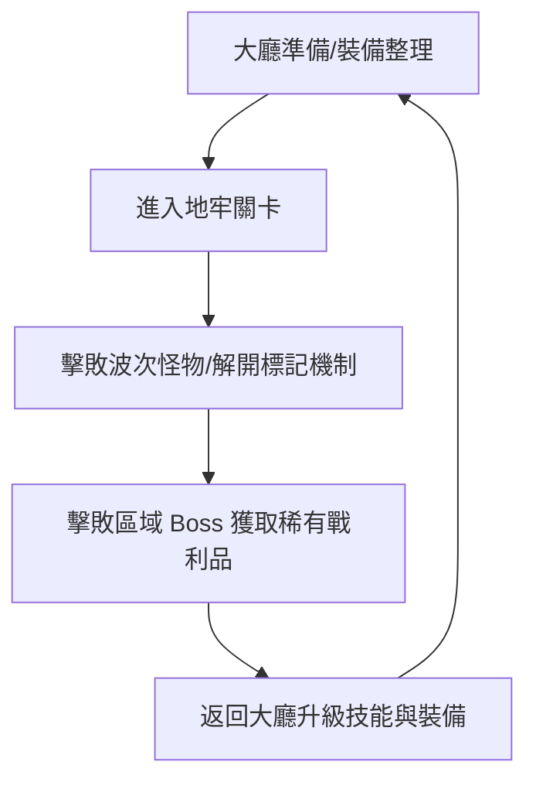
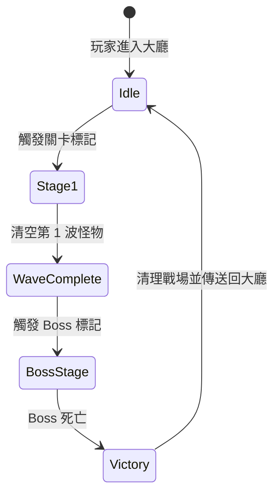

# 🎮 遊戲企劃書標準架構模板 (Game Design Document Template)

> 本模板專為遊戲開發團隊與 Minecraft Add-on / 地牢系統設計，適合直接匯入 **Docmost**、**GitHub** 或 **Obsidian** 知識庫使用。

---

## 📂 企劃知識庫總目錄結構 (Folder Architecture)

```text
my-game-gdd/
├── README.md                           # 企劃庫總覽與最新異動 (Changelog)
├── AGENTS.md                           # 給 AI Agent 與團隊看的開發鐵律
├── 01-High-Concept/                    # 核心概念與玩法
├── 02-World-Building/                  # 世界觀與美術規範
├── 03-Systems-Design/                  # 核心系統機制設計
├── 04-Content-Design/                  # 怪物、技能、裝備與數值
├── 05-Level-Design/                    # 地牢關卡與波次流程
└── 06-Technical-Pipeline/              # 程式規範與命名空間 SOP
```

---

## 📄 企劃書模組詳細範本內容 (GDD Document Templates)

### 📌 01. 核心概念與企劃總覽 (`01-High-Concept/overview.md`)

```markdown
# 1. 遊戲核心概念 (High Concept)

## 1.1 專案基本資訊
- **專案名稱**：[填寫專案名稱，如：魔幻地牢 Add-on]
- **核心玩法**：[例：Roguelike 動作地牢刷寶 / 雙舞台關卡挑戰]
- **目標受眾**：[例：Minecraft 合作地牢玩家、RPG 愛好者]
- **支援平台**：Minecraft Bedrock Edition (基岩版)

## 1.2 核心玩法循環 (Core Loop)


## 1.3 核心特色 (Key Features)
1. **雙舞台雙座標機制**：戰鬥區與等待區完全隔離，防干擾。
2. **標記方塊系統 (`ml_mod:`)**：靈活放置標記觸發怪物生成與機關。
3. **動態 Boss 階段戰鬥**：多階段招式與全螢幕技能提示。
```

---

### 📌 02. 系統機制規格書 (`03-Systems-Design/combat_and_dungeon.md`)

```markdown
# 2. 系統機制規格書 (Systems Spec)

## 2.1 標記方塊機制 (`ml_mod:marker_block`)
- **機制描述**：用於在地牢內標定怪物生成點、關卡閘門與開關。
- **命名空間鐵律**：所有識別符必須以 `ml_mod:` 開頭。
- **觸發條件**：
  * 當玩家進入標記方塊半徑 `R=15` 範圍內時觸發波次。
  * 怪物清空後自動發送事件給 `StageManager` 進行下階段切換。

## 2.2 傷害與狀態公式 (Damage Formula)
$$ \text{最終傷害} = (\text{基礎攻擊力} + \text{裝備加成}) \times (1 - \frac{\text{護甲值}}{\text{護甲值} + 100}) $$

## 2.3 關卡波次狀態機 (Stage FSM)

```

---

### 📌 03. 內容與數值規格書 (`04-Content-Design/monsters_and_items.md`)

```markdown
# 3. 怪物與數值規格書 (Content Spec)

## 3.1 怪物名稱：[地牢骷髏弓箭手]
- **識別碼 (Identifier)**：`ml_mod:skeleton_archer`
- **對應行為包/資源包**：`addons/ml_dungeon_BP/entities/`

### 數值表 (Stats Table)

| 階段/難度 | 生命值 (HP) | 基礎傷害 | 移動速度 | 攻擊距離 | 特殊技能 |
| :--- | :--- | :--- | :--- | :--- | :--- |
| **Normal** | 50 | 12 | 0.28 | 16 格 | 穿透三連射 |
| **Hard** | 100 | 25 | 0.32 | 20 格 | 擊退火矢 + 毒霧 |

### 掉落物清單 (Loot Table)
- `ml_mod:dungeon_token` (100% 掉落, 數量 1~3)
- `ml_mod:rare_bow` (5% 幾率掉落)
```

---

### 📌 04. 技術與規範 SOP (`06-Technical-Pipeline/rules.md`)

```markdown
# 4. 團隊開發鐵律與 SOP

## 4.1 核心三大鐵律
1. **命名空間鐵律**：所有識別符（方塊、物品、粒子、維度）必須以 `ml_mod:` 開頭。
2. **優先熱重載 Policy**：修改 `.js` 腳本時優先進行 `/reload` 熱重載，禁止無故重啟 BDS 伺服器。
3. **版號遞增限制**：版號只能在小版號順延往上加（例如 `1.2.6` ➔ `1.2.7`）。

## 4.2 Git 提交與 Changelog 規範
- Git 提交訊息必須使用**繁體中文**（例：`功能: 新增第三關關卡配置與 BOSS 波次`）。
- 每次更新版號必須同步更新 `CHANGELOG.md`。
```

---

## 🎯 建議如何在 Docmost / GitHub 中啟用本模板

1. **在 Docmost 中**：
   * 點選建立 **Space（團隊空間）**，名稱命名為 `🎮 遊戲企劃知識庫 (GDD)`。
   * 將上述目錄結構建立為 Docmost 的**嵌套頁面 (Nested Pages)**。
   * 團隊開會時，企劃直接在頁面上輸入 `/` 使用 Markdown 與 Mermaid 繪製。

2. **在 GitHub 中**：
   * 將本模板直接複製存為專案根目錄的 `docs/` 資料夾中。
   * 用於讓團隊與 AI 助手（如 Copilot / Antigravity）直接索引。
